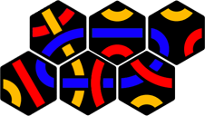

# SolvingTantrix
Solving Tantrix is an open-source program for solving _Tantrix Discovery_ puzzles, written in Java.

The Solving Tantrix source code is available under the MIT license.

Enjoy -- Lorenz

## Table of Contents

* [Introduction](#introduction)
* [Solution](#solution)
* [Results](#results)
* [Build Instructions](#build-instructions)

## Introduction

I recently received a _Tantrix Discovery_ puzzle, which consists of 10 numbered, hexagonal tiles:

The goal is to arrange a subset of the tiles by applying the following rules:
1. All line segments at the edges of neighboring tiles must match their colors.
1. Some line segments of the tiles must form a closed loop in a given color.

You start with tiles 1-3, then work your way up to the full set of 10 tiles.

For example, tiles 1-4 can be arranged into the following solutions, with the given loop color being red:

This made me curious: How many solutions are possible for a given number of tiles and color? Would mean more tiles more (or fewer?) solutions?

## Solution

I wrote a computer program in Java (the source code is available in this repo) that computes all solutions. It uses a backtracking algorithm and eliminates duplicate solutions by computing a hash value, which it compares with those of previous solutions. It also rejects solutions containing holes (apparently an unofficial Tantrix rule). For each actual solution the program renders an image and saves it to a file.

## Results

The game’s instructions suggest a set of puzzles. Here are **some sample solutions**:
Tiles 1-... | Loop Color | Sample Solution
-------:|------------|:--------------:
3	      | Yellow     | 
4	      | Red        | 
5	      | Red        | 
6	      | Blue       | 
7	      | Red        | 
8	      | Blue       | 
9	      | Yellow     | 
10      | Red        | 
10      | Blue       | 
10      | Yellow     | 

Out of all solutions, one of **my favorite solutions** is this double-loop:

Find a **“poster-like” image** of all 2902 solutions [here](images/poster/poster.png).

Find **individual images** of all 2902 solutions [here](images/solutions).

If you like statistics, here’s a breakdown of the numbers of solutions by tile set and loop color:

Tiles 1-... | Yellow | Red    | Blue
-----------:|-------:|-------:|-------:
3           | 2      | -      | -
4           | -      | 2      | -
5           | -      | 4      | -
6           |	-      | -      | 8
7           | -      | 32     | 36
8           | -      | -      | 84
9           | 114    | -      | -
10          | 388    | 1280   | 952
**Total**   | **504** | **1318** | **1080**

They add up to a grand total of	2902 solutions.

## Build Instructions

Build the program with the Eclipse IDE by using the provided Eclipse project files. I used Eclipse 2019-12 (4.10.0) running Java 1.8, but older versions might do as well. After running the program, find the image files of each solution in the `solutions` subfolder of the project.

Source of Tantrix tile images: [Wikipedia Tantrix](https://en.wikipedia.org/wiki/Tantrix "Wikipedia Tantrix") with own modifications
